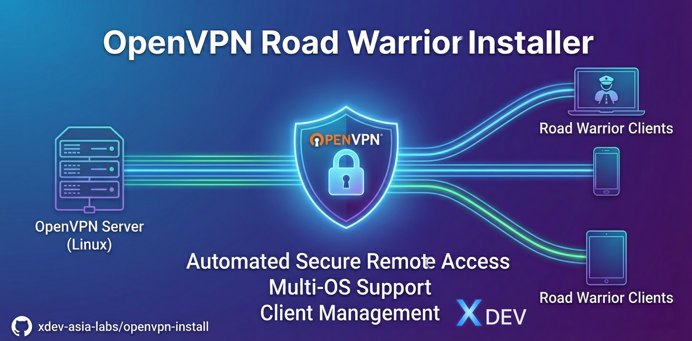

<p align="center">
  
</p>

<h1 align="center">OpenVPN Road Warrior Installer</h1>

<p align="center">
  <a href="https://github.com/xdev-asia-labs/openvpn-install/actions/workflows/test.yml"></a>
  <a href="https://github.com/xdev-asia-labs/openvpn-install/actions/workflows/security.yml"></a>
  <a href="https://github.com/xdev-asia-labs/openvpn-install/actions/workflows/shellcheck.yml"></a>
  <a href="https://github.com/xdev-asia-labs/openvpn-install/releases"></a>
  <a href="https://opensource.org/licenses/MIT"></a>
</p>

<p align="center">
  
  
  
  
  
</p>

<p align="center">
  <a href="https://github.com/xdev-asia-labs/openvpn-install/stargazers"></a>
  <a href="https://github.com/xdev-asia-labs/openvpn-install/network/members"></a>
  <a href="https://github.com/xdev-asia-labs/openvpn-install/commits/main"></a>
  <a href="https://github.com/xdev-asia-labs/openvpn-install"></a>
  <a href="https://github.com/xdev-asia-labs/openvpn-install/graphs/contributors"></a>
</p>

<p align="center">
  <a href="README.md">🇬🇧 English</a> •
  <a href="README-vi.md">🇻🇳 Tiếng Việt</a> •
  <a href="https://xdev.asia/blog/cai-dat-openvpn-tren-ubuntu-24-04">📖 Hướng dẫn chi tiết</a>
</p>

---

Script tự động cài đặt và quản lý máy chủ OpenVPN với cấu hình road warrior trên các máy chủ Linux.

> 📖 **[Đọc hướng dẫn chi tiết tại đây](https://xdev.asia/blog/cai-dat-openvpn-tren-ubuntu-24-04)**

## Mục lục

- [Tổng quan](#tổng-quan)
- [Hệ điều hành được hỗ trợ](#hệ-điều-hành-được-hỗ-trợ)
- [Yêu cầu](#yêu-cầu)
- [Tính năng](#tính-năng)
- [Cài đặt](#cài-đặt)
- [Sử dụng](#sử-dụng)
- [Kết nối Client](#kết-nối-client)
- [Xử lý sự cố](#xử-lý-sự-cố)
- [Vị trí các file](#vị-trí-các-file)
- [Câu hỏi thường gặp](#câu-hỏi-thường-gặp)
- [Giấy phép](#giấy-phép)
- [Hỗ trợ](#hỗ-trợ)

## Tổng quan

Script này cung cấp cách đơn giản và tương tác để thiết lập máy chủ OpenVPN cho phép nhiều client (road warriors) kết nối an toàn đến mạng của bạn. Script xử lý toàn bộ quá trình thiết lập bao gồm tạo chứng chỉ, cấu hình tường lửa và quản lý client.

## Hệ điều hành được hỗ trợ

- **Ubuntu** 22.04 trở lên
- **Debian** 11 trở lên
- **AlmaLinux** 9 trở lên
- **Rocky Linux** 9 trở lên
- **CentOS** 9 trở lên
- **Fedora** (các phiên bản mới nhất)

## Yêu cầu

- Quyền truy cập root hoặc sudo
- Thiết bị TUN khả dụng (bắt buộc cho VPN)
- Máy chủ phải có địa chỉ IP công cộng hoặc có thể truy cập qua port forwarding
- Ít nhất một interface mạng có địa chỉ IPv4

## Tính năng

### Cài đặt ban đầu

- Tự động phát hiện và xác thực hệ điều hành
- Trình hướng dẫn thiết lập tương tác
- Hỗ trợ IPv4 và IPv6
- Lựa chọn giao thức UDP hoặc TCP
- Cấu hình cổng tùy chỉnh
- Nhiều tùy chọn nhà cung cấp DNS (Google, Cloudflare, OpenDNS, Quad9, AdGuard)
- Cấu hình tường lửa tự động (firewalld hoặc iptables)
- Tạo chứng chỉ và key sử dụng Easy-RSA
- Tạo cấu hình client đầu tiên

### Quản lý Client

- Thêm client mới
- Thu hồi client hiện có
- Tạo file cấu hình `.ovpn`
- Chứng chỉ có hiệu lực: 10 năm

### Tính năng bảo mật

- Xác thực SHA512
- Mã hóa TLS với tls-crypt
- DH parameters sử dụng nhóm ffdhe2048
- Xác thực client dựa trên chứng chỉ
- Hỗ trợ CRL (Certificate Revocation List)
- SELinux support cho các hệ thống hỗ trợ

### Tính năng nâng cao

- Phát hiện và tối ưu hóa cho môi trường container
- Hỗ trợ IPv6 đầy đủ
- Cấu hình DNS linh hoạt
- Tùy chọn chọn interface mạng
- Logging và xử lý lỗi toàn diện
- Sao lưu tự động trước khi gỡ cài đặt

## Cài đặt

### Bước 1: Tải script

```bash
wget https://raw.githubusercontent.com/xdev-asia-labs/openvpn-install/main/openvpn-install.sh
chmod +x openvpn-install.sh
```

Hoặc sử dụng curl:

```bash
curl -O https://raw.githubusercontent.com/xdev-asia-labs/openvpn-install/main/openvpn-install.sh
chmod +x openvpn-install.sh
```

### Bước 2: Chạy script

```bash
sudo bash openvpn-install.sh
```

### Bước 3: Làm theo hướng dẫn

Script sẽ hỏi bạn:

1. **Địa chỉ IP**: Script tự động phát hiện IP công cộng của bạn. Xác nhận hoặc nhập IP tùy chỉnh
2. **IPv6**: Có muốn kích hoạt IPv6 không (nếu có sẵn)
3. **Cổng**: Mặc định là 1194. Bạn có thể thay đổi nếu cần
4. **Giao thức**: Chọn UDP (khuyến nghị) hoặc TCP
5. **DNS**: Chọn nhà cung cấp DNS:
   - Current system resolvers
   - Google
   - Cloudflare
   - OpenDNS
   - Quad9
   - AdGuard DNS
6. **Tên client**: Nhập tên cho client đầu tiên của bạn

### Ví dụ cài đặt

```bash
$ sudo bash openvpn-install.sh

Welcome to this OpenVPN road warrior installer!

IPv4 address: 192.168.1.100
Public IPv4 address / hostname: 203.0.113.10

Which protocol should OpenVPN use?
   1) UDP (recommended)
   2) TCP
Protocol [1]: 1

What port should OpenVPN listen to?
Port [1194]: 1194

Select a DNS server for the clients:
   1) Current system resolvers
   2) Google
   3) Cloudflare
   4) OpenDNS
   5) Quad9
   6) AdGuard DNS
DNS server [1]: 2

Enter a name for the first client:
Name [client]: my-laptop

OpenVPN installation is ready to begin.
Press any key to continue...
```

## Sử dụng

### Thêm Client mới

Sau khi cài đặt, bạn có thể thêm client bổ sung bất cứ lúc nào:

```bash
sudo bash openvpn-install.sh
```

Chọn tùy chọn **1) Add a new client**

Script sẽ:
- Yêu cầu tên cho client mới
- Tạo chứng chỉ client
- Tạo file cấu hình `.ovpn`
- Lưu file trong thư mục hiện tại

### Thu hồi Client

Để thu hồi quyền truy cập của client:

```bash
sudo bash openvpn-install.sh
```

Chọn tùy chọn **2) Revoke an existing client**

Script sẽ:
- Hiển thị danh sách các client hiện có
- Thu hồi chứng chỉ của client đã chọn
- Cập nhật Certificate Revocation List (CRL)
- Xóa các file liên quan đến client

### Gỡ cài đặt OpenVPN

Để gỡ bỏ hoàn toàn OpenVPN:

```bash
sudo bash openvpn-install.sh
```

Chọn tùy chọn **3) Remove OpenVPN**

Script sẽ:
- Tạo bản sao lưu cấu hình tại `/root/openvpn_backup_[timestamp]/`
- Dừng dịch vụ OpenVPN
- Xóa quy tắc tường lửa
- Gỡ cài đặt gói OpenVPN
- Xóa tất cả file cấu hình

## Kết nối Client

### Windows

1. Tải và cài đặt [OpenVPN GUI](https://openvpn.net/community-downloads/)
2. Sao chép file `.ovpn` vào `C:\Program Files\OpenVPN\config\`
3. Chạy OpenVPN GUI với quyền Administrator
4. Click chuột phải vào biểu tượng OpenVPN trong system tray
5. Chọn file cấu hình của bạn và click "Connect"

### macOS

1. Tải và cài đặt [Tunnelblick](https://tunnelblick.net/)
2. Nhấp đúp vào file `.ovpn` để thêm nó vào Tunnelblick
3. Nhập password khi được yêu cầu
4. Click vào biểu tượng Tunnelblick trong menu bar
5. Chọn cấu hình của bạn và click "Connect"

### Linux

**Sử dụng OpenVPN trực tiếp:**

```bash
sudo openvpn --config client.ovpn
```

**Sử dụng NetworkManager:**

```bash
sudo nmcli connection import type openvpn file client.ovpn
nmcli connection up client
```

**Sử dụng systemd:**

```bash
sudo cp client.ovpn /etc/openvpn/client/client.conf
sudo systemctl start openvpn-client@client
sudo systemctl enable openvpn-client@client
```

### Android

1. Cài đặt [OpenVPN Connect](https://play.google.com/store/apps/details?id=net.openvpn.openvpn) từ Google Play Store
2. Chuyển file `.ovpn` đến thiết bị Android của bạn
3. Mở ứng dụng OpenVPN Connect
4. Nhấn vào biểu tượng "+" hoặc "Import"
5. Chọn "FILE" và tìm file `.ovpn` của bạn
6. Nhấn "ADD" và sau đó kết nối

### iOS

1. Cài đặt [OpenVPN Connect](https://apps.apple.com/us/app/openvpn-connect/id590379981) từ App Store
2. Chuyển file `.ovpn` qua:
   - AirDrop
   - Email (gửi file đến chính bạn)
   - iCloud Drive hoặc cloud storage khác
3. Mở file bằng OpenVPN Connect
4. Nhấn vào biểu tượng "+" để import
5. Kết nối đến VPN

## Xử lý sự cố

### Kiểm tra trạng thái dịch vụ OpenVPN

```bash
sudo systemctl status openvpn-server@server
```

Đầu ra sẽ hiển thị xem dịch vụ có đang chạy không và bất kỳ lỗi gần đây nào.

### Xem log OpenVPN

```bash
sudo journalctl -u openvpn-server@server -f
```

Lệnh này sẽ theo dõi log real-time. Nhấn Ctrl+C để thoát.

### Kiểm tra quy tắc tường lửa

**Với firewalld:**

```bash
sudo firewall-cmd --list-all
```

**Với iptables:**

```bash
sudo iptables -t nat -L -n -v
sudo iptables -L -n -v
```

### Kiểm tra IP Forwarding

```bash
cat /proc/sys/net/ipv4/ip_forward
```

Phải trả về `1`. Nếu không, kích hoạt nó:

```bash
sudo sysctl -w net.ipv4.ip_forward=1
```

### Các vấn đề phổ biến

#### Lỗi: Client can connect but has no internet access

**Nguyên nhân:** Quy tắc NAT không được cấu hình đúng hoặc IP forwarding bị tắt.

**Giải pháp:**

1. Kiểm tra IP forwarding (xem bên trên)
2. Xác minh quy tắc NAT:

```bash
sudo iptables -t nat -L -n -v | grep MASQUERADE
```

3. Khởi động lại dịch vụ OpenVPN:

```bash
sudo systemctl restart openvpn-server@server
```

#### Lỗi: Connection timeout

**Nguyên nhân:** Tường lửa chặn cổng hoặc server đằng sau NAT chưa được cấu hình đúng.

**Giải pháp:**

- Xác minh port forwarding nếu server đằng sau NAT/router
- Kiểm tra tường lửa cho phép cổng OpenVPN:

```bash
sudo firewall-cmd --list-ports  # firewalld
sudo iptables -L -n | grep <port>  # iptables
```

#### Lỗi: DNS not working

**Nguyên nhân:** Client không sử dụng DNS server của VPN.

**Giải pháp:**

1. Kiểm tra cấu hình DNS trong `/etc/openvpn/server/server.conf`
2. Trên Windows, chạy OpenVPN GUI với quyền Administrator
3. Trên Linux, đảm bảo `resolvconf` được cài đặt:

```bash
sudo apt install resolvconf  # Ubuntu/Debian
sudo dnf install openresolv  # Fedora/RHEL
```

#### Lỗi: TUN device not available

**Nguyên nhân:** TUN/TAP module không được load hoặc không có sẵn (phổ biến trong môi trường ảo hóa).

**Giải pháp:**

1. Kiểm tra xem TUN có sẵn không:

```bash
cat /dev/net/tun
```

2. Load TUN module:

```bash
sudo modprobe tun
```

3. Với VPS/containers, kích hoạt TUN trong control panel của provider

#### Lỗi: "tls-crypt unwrap error: packet too short"

**Log hiển thị:**

```log
tls-crypt unwrap error: packet too short
TLS Error: tls-crypt unwrapping failed from [AF_INET]x.x.x.x:xxxxx
```

**Nguyên nhân:** Client đang sử dụng file cấu hình `.ovpn` không khớp với tls-crypt key của server.

**Giải pháp:**

1. **Đối với client được ủy quyền:** Tạo lại cấu hình client:

```bash
sudo bash openvpn-install.sh
```

Chọn tùy chọn 1 để thêm client mới hoặc tùy chọn 2 để thu hồi và tạo lại client hiện có.

2. **Đối với IP không xác định:** Đây có thể là các cuộc tấn công quét cổng - có thể bỏ qua an toàn
3. **Sau khi cài đặt lại server:** Tất cả file cấu hình client hiện có trở nên không hợp lệ và phải được tạo lại

#### Lỗi: Certificate verify failed

**Nguyên nhân:** Chứng chỉ không khớp hoặc đã hết hạn.

**Giải pháp:**

Kiểm tra ngày hết hạn của chứng chỉ:

```bash
sudo openssl x509 -in /etc/openvpn/server/server.crt -noout -dates
```

Nếu hết hạn, tạo lại chứng chỉ hoặc cài đặt lại OpenVPN.

### Kiểm tra hiệu suất

#### Kiểm tra băng thông

```bash
# Trên server
iperf3 -s

# Trên client (kết nối qua VPN)
iperf3 -c 10.8.0.1
```

#### Kiểm tra độ trễ

```bash
# Từ client đến VPN gateway
ping 10.8.0.1

# Từ client qua VPN ra internet
ping 8.8.8.8
```

## Vị trí các file

### Cấu hình Server

- **Server config:** `/etc/openvpn/server/server.conf`
- **Certificates:** `/etc/openvpn/server/`
  - `ca.crt` - Certificate Authority
  - `server.crt` - Server certificate
  - `server.key` - Server private key
  - `dh.pem` - Diffie-Hellman parameters
  - `tc.key` - TLS-Crypt key
  - `crl.pem` - Certificate Revocation List
- **Easy-RSA:** `/etc/openvpn/server/easy-rsa/`
- **Client common config:** `/etc/openvpn/server/client-common.txt`

### Cấu hình Client

- File `.ovpn` được tạo tại thư mục hiện tại nơi bạn chạy script
- Mỗi client có một file cấu hình riêng chứa:
  - Client certificate
  - Client private key
  - CA certificate
  - TLS-Crypt key
  - Server connection settings

### Log files

- **OpenVPN logs:** `sudo journalctl -u openvpn-server@server`
- **Script logs:** `/var/log/openvpn-install.log`

## Cấu hình nâng cao

### Cho phép client truy cập mạng local

Mặc định, client chỉ có thể truy cập internet qua VPN. Để cho phép truy cập mạng local:

1. Chỉnh sửa `/etc/openvpn/server/server.conf`
2. Thêm route cho mạng local của bạn:

```bash
push "route 192.168.1.0 255.255.255.0"
```

3. Khởi động lại OpenVPN:

```bash
sudo systemctl restart openvpn-server@server
```

### Thay đổi cổng hoặc giao thức

1. Chỉnh sửa `/etc/openvpn/server/server.conf`:

```bash
port 443
proto tcp
```

2. Cập nhật quy tắc tường lửa:

```bash
# Firewalld
sudo firewall-cmd --add-port=443/tcp --permanent
sudo firewall-cmd --reload

# iptables
sudo iptables -A INPUT -p tcp --dport 443 -j ACCEPT
```

3. Khởi động lại OpenVPN:

```bash
sudo systemctl restart openvpn-server@server
```

4. Cập nhật file cấu hình client với cổng và giao thức mới

### Sử dụng custom DNS

Chỉnh sửa `/etc/openvpn/server/server.conf` và thay đổi dòng DNS:

```bash
push "dhcp-option DNS 1.1.1.1"
push "dhcp-option DNS 1.0.0.1"
```

### Tăng mức độ logging

Chỉnh sửa `/etc/openvpn/server/server.conf`:

```bash
verb 4  # Mức độ từ 0 đến 11, 4 là recommended cho troubleshooting
```

## Câu hỏi thường gặp

**Q: Có thể chạy script này trong container Docker không?**
A: Có, script phát hiện môi trường container và điều chỉnh cấu hình phù hợp. Đảm bảo container có quyền truy cập vào thiết bị TUN và NET_ADMIN capabilities.

**Q: Có thể thêm bao nhiêu client?**
A: Subnet mặc định (10.8.0.0/24) cho phép 254 client. Bạn có thể mở rộng bằng cách sửa đổi cấu hình server để sử dụng subnet lớn hơn.

**Q: Có thể thay đổi cổng sau khi cài đặt không?**
A: Có, chỉnh sửa `/etc/openvpn/server/server.conf`, cập nhật quy tắc tường lửa và khởi động lại dịch vụ. Bạn cũng sẽ cần tạo lại tất cả file cấu hình client.

**Q: Script này có phù hợp cho môi trường production không?**
A: Có, script sử dụng các phương pháp bảo mật tiêu chuẩn công nghiệp và được sử dụng rộng rãi trong môi trường production.

**Q: Có thể sử dụng chứng chỉ của riêng tôi không?**
A: Script được thiết kế để tạo chứng chỉ riêng. Quản lý chứng chỉ thủ công sẽ yêu cầu sửa đổi script.

**Q: Làm sao để sao lưu cấu hình?**
A: Sao lưu toàn bộ thư mục `/etc/openvpn/server/` và các file `.ovpn` của bạn. Script tự động tạo backup trước khi gỡ cài đặt.

**Q: Client có thể truy cập mạng local của tôi không?**
A: Mặc định là không. Client chỉ có thể truy cập internet qua VPN. Bạn có thể thêm routes để cho phép truy cập mạng local (xem phần Cấu hình nâng cao).

**Q: Nếu tôi mất file .ovpn thì sao?**
A: Bạn có thể tạo lại bằng cách thêm lại client cùng tên (thu hồi chứng chỉ cũ trước nếu lo ngại về bảo mật).

**Q: VPN có hoạt động trên mạng di động không?**
A: Có, OpenVPN hoạt động tốt trên mạng di động. Đảm bảo chọn UDP làm giao thức cho hiệu suất tốt nhất.

**Q: Có thể có nhiều client kết nối cùng lúc không?**
A: Có, nhiều client có thể kết nối đồng thời. Mỗi client nên có chứng chỉ riêng.

**Q: Server có ghi log hoạt động của client không?**
A: Mặc định, OpenVPN ghi log các kết nối và ngắt kết nối. Để tăng cường privacy, bạn có thể giảm mức độ logging trong server.conf.

**Q: Làm thế nào để cập nhật OpenVPN lên phiên bản mới?**
A: Sử dụng package manager của hệ điều hành:

```bash
# Ubuntu/Debian
sudo apt update && sudo apt upgrade openvpn

# Fedora/RHEL/CentOS
sudo dnf update openvpn
```

Sau đó khởi động lại dịch vụ:

```bash
sudo systemctl restart openvpn-server@server
```

## Bảo mật

### Best Practices

1. **Sử dụng mật khẩu mạnh** cho private keys nếu cần bảo mật cao hơn
2. **Thay đổi cổng mặc định** để tránh các cuộc quét tự động
3. **Cập nhật thường xuyên** server và OpenVPN lên phiên bản mới nhất
4. **Giám sát logs** để phát hiện hoạt động bất thường
5. **Thu hồi ngay** chứng chỉ của các client không còn sử dụng
6. **Sao lưu định kỳ** cấu hình và keys
7. **Sử dụng tường lửa** để hạn chế truy cập vào cổng quản lý

### Hardening

Để tăng cường bảo mật, xem xét các tùy chọn sau trong `/etc/openvpn/server/server.conf`:

```bash
# Giới hạn cipher suites
cipher AES-256-GCM
auth SHA512

# Giảm quyền sau khi khởi động
user nobody
group nogroup

# Chroot (advanced)
chroot /var/empty

# Kiểm tra chứng chỉ client nghiêm ngặt hơn
remote-cert-tls client

# Disable TLS renegotiation
reneg-sec 0
```

## Đóng góp

Chúng tôi hoan nghênh mọi đóng góp! Để đóng góp:

1. Fork repository
2. Tạo feature branch (`git checkout -b feature/AmazingFeature`)
3. Commit thay đổi của bạn (`git commit -m 'Add some AmazingFeature'`)
4. Push lên branch (`git push origin feature/AmazingFeature`)
5. Mở Pull Request

### Guidelines

- Tuân thủ coding style hiện có
- Thêm comments cho code phức tạp
- Cập nhật documentation khi cần
- Test kỹ trên các hệ điều hành được hỗ trợ

## Giấy phép

MIT License - Xem header của script để biết toàn văn giấy phép.

Copyright (c) 2013 Nyr. Released under the MIT License.
Copyright (c) 2025 xdev-asia-labs.

## Hỗ trợ

Để báo lỗi, đặt câu hỏi hoặc đóng góp:

- **GitHub Issues:** <https://github.com/xdev-asia-labs/openvpn-install/issues>
- **Pull Requests:** Chúng tôi hoan nghênh các đóng góp!
- **Blog:** <https://xdev.asia/blog/cai-dat-openvpn-tren-ubuntu-24-04>
- **Website:** <https://xdev.asia>

## Credits

Script gốc được tạo bởi [Nyr](https://github.com/Nyr/openvpn-install) và được cải tiến bởi [xdev-asia-labs](https://github.com/xdev-asia-labs).

## Changelog

### Version 2.0.0 (2025-11)

- Cải thiện xử lý lỗi và logging
- Thêm hỗ trợ cho nhiều distro Linux hơn
- Tối ưu hóa cho môi trường container
- Cập nhật Easy-RSA lên phiên bản 3.2.1
- Thêm nhiều tùy chọn DNS
- Cải thiện bảo mật với tls-crypt
- Thêm IPv6 support
- Sửa lỗi tls-crypt unwrap error

---

**Cập nhật lần cuối:** Tháng 11/2025
